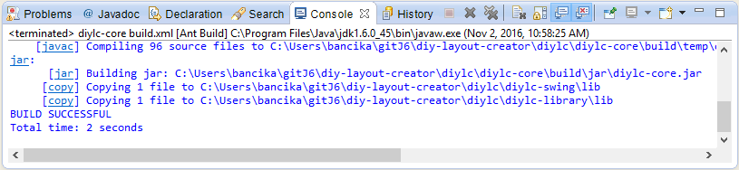

# Prerequisites

DIY Layout Creator 5 has updated the build system to Maven. 
Your IDE may already bundle the tools required to work on DIYLC, so try opening via the pom.xml file in the *diylc* directory.

Otherwise, you may be able to get everything you need to build and run from your package manager, e.g. on Debian systems you can:

`sudo apt install default-jre default-jdk maven`

Installation on Windows is a bit more complicated. For the JDK you can use Adoptium's OpenJDK: <https://adoptium.net/>

Maven must be downloaded and added to the path manually which can be quite involved, but there is a guide here: <https://www.geeksforgeeks.org/installation-guide/how-to-install-apache-maven-on-windows/> 

# Building

Once everything is installed, you can build DIYLC. All of the main DIYLC source code is inside the *diylc* folder, so move inside it and tell maven to build the project. Unlike before, all of the sub-projects are built from the one command:

`mvn package`

If the build went fine, you should see something like this in the console. There may be a few warnings, but it is okay to ignore them.

This will build the diylc.jar file under the *target* directory. You can run this directly using `java -jar diylc.jar`, although you may get complaints that you did not use the proper startup exectuable/script, which can usually be ignored.

There is a script that will automatically build the deployed versions for all platforms, as it is a Bash script it will only work in *nix environments (e.g. WSL), and the success of the build depends on whether you have the required build tooling for the profile (e.g. AppImageTool) already installed.

`./build-all-profiles.sh`
