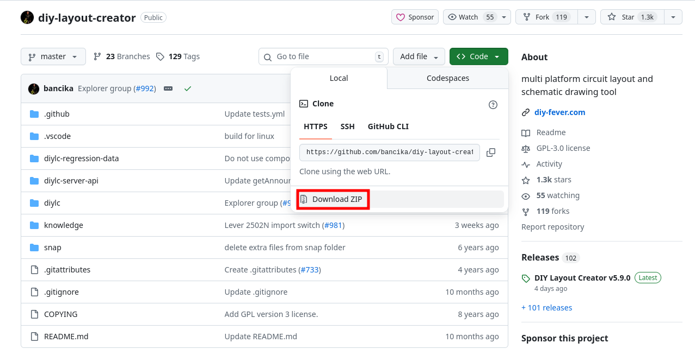
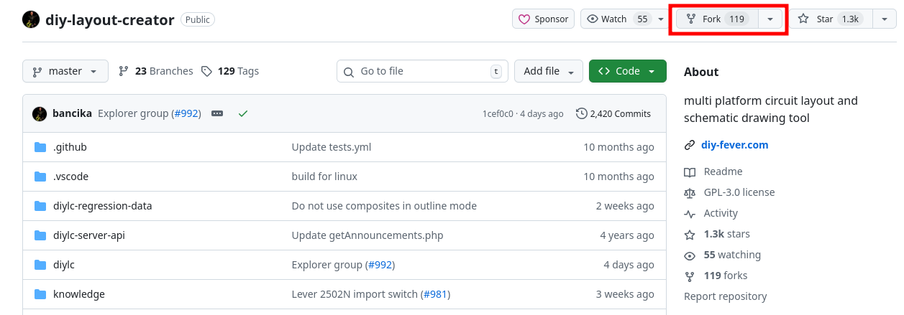
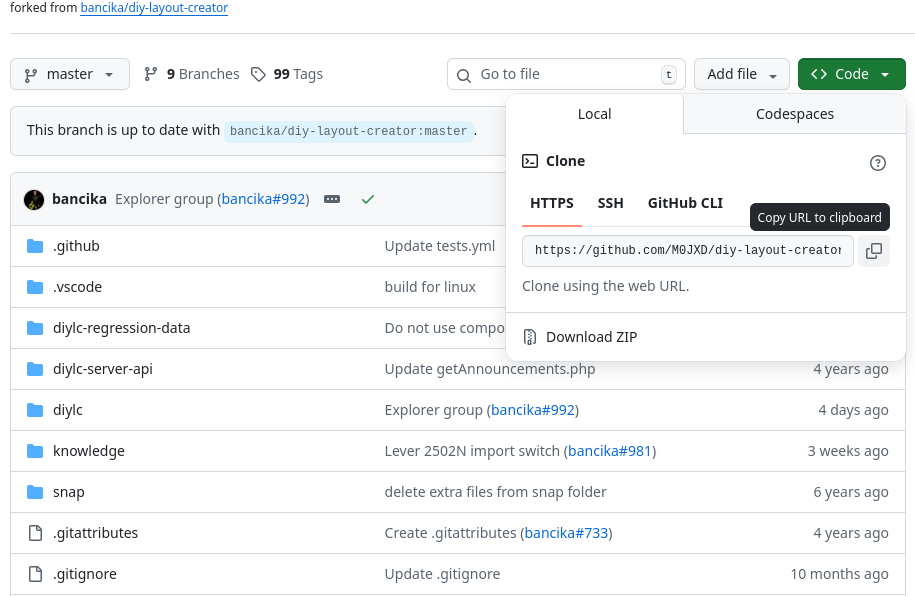

# Downloading Source

DIYLC's build system has changed, and Eclipse is no longer recommended for development.

To download the source, you can use GitHub's download option:

You can then unzip it and continue to the [build](Building.md) document.

However if you wish to contribute, it is more convienient to fork the repository and use git to clone from your fork.

Click the fork button and follow the steps:

From the new fork repo on your account, copy the git clone link:

The next instructions are dependent on your working environment. Your chosen editor/IDE may have built in utilities to manage git repositorys that may be preferable to you. However they all use Git underneath, to do so directly (presuming you have Git installed) you may simply issue:

`git clone <YOUR-GIT-URL>`

Details on installing/using Git are outside the scope of this manual, but there are many tutorials online. As said, it's possible your editor/IDE will handle many things for you. For pushing your changes back to GitHub, you may want to authenticate Git using [GitHub's CLI tool](https://cli.github.com/).
