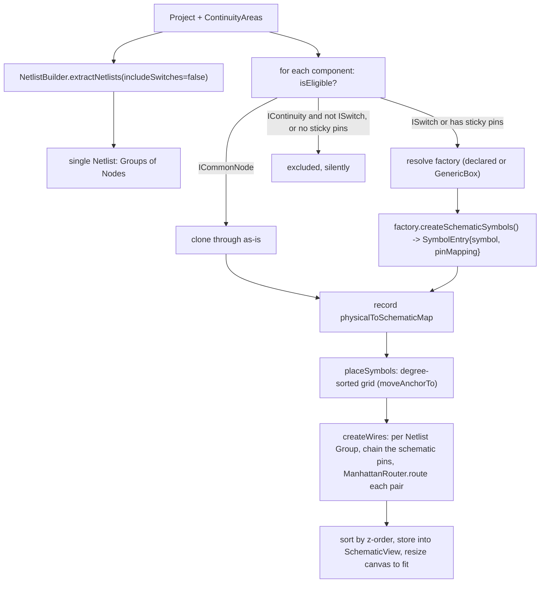

# Schematic View

How the Schematic View is built and **why** it looks the way it does. The original feature
spec and its running status are in [`../schematic_view_plan.md`](../plans/schematic_view_plan.md).

---

## What it does

DIYLC projects are *physical layouts* — components on a board with leads, traces and wires.
The Schematic View derives a **schematic diagram** from that layout on demand: every real
component becomes a schematic symbol, every net becomes an auto-routed wire, and the result is
drawn with the same rendering pipeline as the layout.

It is **derived, not authored**: the user does not draw the schematic. They can rearrange
symbols; wires follow. Switching to the Schematic tab (re)generates it.

## Design principles

1. **Reuse the rendering pipeline.** Schematic symbols are ordinary `IDIYComponent`s drawn by
   the same `DrawingManager` that draws layout components. Wires are components too.
2. **Per-type mapping, with a fallback.** Each physical component type can name an
   `ISchematicFactory`; anything without one gets a generic labeled box. Every component gets
   *some* symbol.
3. **The layout is the source of truth.** The schematic is regenerated / reconciled from the
   layout + its netlist. User edits to the schematic are limited to symbol position.
4. **Zero cost when unused.** The `SchematicView` field on `Project` stays `null` until the
   user first opens the view, so existing `.diy` files are byte-for-byte unchanged.

---

## Module & file map

`diylc-library` depends on `diylc-core`; `diylc-swing` depends on both.

```
diylc-core     data model + SPI (no rendering, no Swing)
  org.diylc.core.SchematicView                      embedded in Project
  org.diylc.core.annotations.ComponentDescriptor.schematicFactory()
  org.diylc.common.ComponentType.schematicFactoryClass
  org.diylc.schematic.ISchematicFactory             the strategy interface
  org.diylc.schematic.SchematicSymbolMapping         factory output: symbol + pin map
  org.diylc.common.INetlistProcessor.getContinuityAreas()   (impl on Presenter)

diylc-library  components + generation logic
  org.diylc.components.schematic.SchematicBox        generic rectangular symbol
  org.diylc.components.schematic.SchematicWire       auto-routed Manhattan wire (IContinuity)
  org.diylc.schematic.ManhattanRouter               routing algorithm (pure)
  org.diylc.schematic.GenericBoxSchematicFactory     default fallback
  org.diylc.schematic.AbstractSimpleSchematicFactory 1:1 pin-for-pin base
  org.diylc.schematic.{Resistor,Capacitor,Diode,Transistor,Inductor,Potentiometer}SchematicFactory
  org.diylc.schematic.SchematicBuilder              initial generation
  org.diylc.schematic.SchematicSynchronizer         incremental reconcile

diylc-swing    UI
  org.diylc.swing.plugins.schematic.SchematicTabPlugin    Layout | Schematic tab strip
  org.diylc.swing.plugins.schematic.SchematicMenuPlugin   Analyze > Schematic View...
  org.diylc.swing.plugins.schematic.SchematicViewFrame    detached viewer window
  org.diylc.swing.plugins.schematic.SchematicPanel        read-only renderer for the window
  org.diylc.swing.plugins.canvas.CanvasPlugin.getCanvasScrollComponent()   (new accessor)
```

---

## Data model

### `SchematicView` (embedded in `Project`)

```java
class SchematicView implements Serializable, Cloneable {
  List<IDIYComponent<?>> components;              // symbols + wires, z-order ascending
  Map<UUID, List<UUID>> physicalToSchematicMap;   // physical component id -> schematic symbol id(s)
  Size width, height, gridSpacing;
}
```

- `Project.getSchematicView()` returns the field (may be `null`).
- `Project.getOrCreateSchematicView()` lazily creates it — **calling this makes the schematic
  persist with the project from now on**.
- `Project.clone()` and `Project.equals()` include the schematic view, so schematic edits go
  through the normal dirty / undo-snapshot machinery.
- Serialized via XStream alongside the rest of `Project`. Older DIYLC ignores the unknown
  field; a `null` field serializes to nothing.

The `physicalToSchematicMap` is 1:N to support multi-section components (a dual triode → two
triode symbols). Pin mappings are **not** stored — they are a pure function of the physical
component and are recomputed by re-running the factory whenever needed.

### `ISchematicFactory` / `SchematicSymbolMapping`

```java
interface ISchematicFactory {
  List<SchematicSymbolMapping> createSchematicSymbols(IDIYComponent<?> physicalComponent);
}

class SchematicSymbolMapping {
  IDIYComponent<?> schematicSymbol;         // fully configured, only needs positioning
  Map<Integer, Integer> pinMapping;         // physical control-point index -> schematic control-point index
  String sectionLabel;                      // optional, e.g. "Section A"
}
```

A type declares its factory on the annotation:

```java
@ComponentDescriptor(name = "Resistor", ..., schematicFactory = ResistorSchematicFactory.class)
```

`ComponentProcessor.extractComponentTypeFrom` reads it into
`ComponentType.getSchematicFactoryClass()`. The default (`ISchematicFactory.class` itself,
used only as a "none" marker) means **no factory declared → use the generic box**.

---

## Generation pipeline — `SchematicBuilder.build(project, continuityAreas)`



- **Eligibility** (`SchematicBuilder.isEligible`):
  - `ICommonNode` (ground, common node) → eligible, cloned through unchanged.
  - `ISwitch` → eligible (drawn as a symbol).
  - other `IContinuity` (wires, traces, solder bridges, board strips) → excluded.
  - no sticky control points (labels, images, shapes, boards) → excluded.
  - Exclusions are silent — no warning.
- **Factory resolution** caches one instance per factory class. Factory exceptions fall back
  to the generic box.
- **Placement** sorts components by connection degree (sum over netlist groups of
  `groupSize - 1`) descending, then drops them into a `ceil(sqrt(n))`-column grid. Multi-symbol
  mappings stack vertically within the cell. `moveAnchorTo` translates *every* control point so
  control point 0 lands on the target, snapshotting the targets first (see *Design decisions*).
- **Wiring** walks each `Group`, resolves every `Node` (physical component + pin index) to a
  schematic `(symbol, schematicPinIndex, location)` via the factory's `pinMapping`, sorts the
  pins left-to-right / top-to-bottom, and creates a `SchematicWire` between consecutive pins
  (a chain, not a star). Each wire stores `sourceComponentId/sourcePinIndex` and
  `targetComponentId/targetPinIndex` plus the routed `routePoints`. Already-placed wire
  segments are fed to the router as obstacles.

## Incremental sync — `SchematicSynchronizer.synchronize(project, continuityAreas)`

Runs every time the user switches to the Schematic tab. If the view is empty it does a full
`SchematicBuilder.build`. Otherwise:

- **Kept** components: re-run the factory for fresh symbols + pin maps, but keep the *existing*
  positioned symbol instance, only refreshing its name/value.
- **New** components (id in layout, not in map): place fresh symbols in the next free grid cell.
- **Removed** components (id in map, not in layout): drop their symbols.
- **Wires** are always rebuilt from scratch from the current netlist — they are cheap.

## Routing — `ManhattanRouter`

Pure, no dependencies on the rest of the system. `route(start, end, startDir, endDir,
obstacles, grid)` returns axis-aligned way-points from `start` to `end`.

- Aligned endpoints → a single straight segment.
- Otherwise it generates candidate routes: two L shapes, several
  horizontal-vertical-horizontal routes (vertical middle leg at candidate x positions) and
  several vertical-horizontal-vertical routes (midpoint / quarter points / grid offsets).
- Each candidate is scored: `length*0.01 + bends*6 + crossings*15 + overlapLength*0.5 +
  directionMismatchPenalty`. `startDir` / `endDir` are the directions the wire should leave
  each pin — away from the symbol centroid along the dominant axis
  (`SchematicBuilder.exitDirection`).
- Lowest score wins; the result is de-duplicated and collinear middle points are dropped.

`SchematicBuilder.rerouteWires(components)` re-routes every wire from the *current* symbol pin
positions (looked up by component id) — used after the user moves a symbol.

---

## UI

### The tab — `SchematicTabPlugin`

The tab renders through the **real canvas**, not a bespoke widget.

- The plugin owns a second `Presenter` and a second `CanvasPlugin`, installed on that
  presenter. Both `CanvasPlugin`s inject their `RulerScrollPane` into the center `BoxLayout`
  panel; the plugin shows exactly one at a time.
- A `JToolBar` with two `JToggleButton`s (`Layout` / `Schematic`) is injected below them.
  **No zoom or refresh buttons** — rulers, scroll bars and wheel/gesture zoom come from the
  `RulerScrollPane`; refresh is automatic on tab switch.
- Switching to **Schematic**: `SchematicSynchronizer.synchronize(...)` on the layout project,
  wrap the resulting `SchematicView` in a throwaway `Project` (shares the same component
  instances), `loadProject()` it into the schematic presenter, swap the visible scroll pane,
  `scrollToCenterAndShowContents()`.
- The wrapper project **locks the `WIRING` layer** so wires are inert; a listener on the
  schematic presenter re-routes wires on `PROJECT_MODIFIED` (fires once when a drag-move ends).

### The detached window — `SchematicMenuPlugin` / `SchematicViewFrame` / `SchematicPanel`

*Analyze → Schematic View…* opens a separate window that renders the `SchematicView` through
a private `DrawingManager` (read-only, no `Presenter`) and adds PNG export. Independent of
the tab; the simplest possible viewer.

---

## How to add a dedicated symbol for a component type

1. Write an `ISchematicFactory` in `diylc-library` under `org.diylc.schematic`. For a simple
   1:1 mapping, extend `AbstractSimpleSchematicFactory` and return `new XxxSymbol()` from
   `createSymbol()` (override `electricalPinCount()` if not 2).
2. Point the physical component at it: add `schematicFactory = XxxSchematicFactory.class` to
   its `@ComponentDescriptor` and import the class.
3. If the symbol's pin order does not match the physical component's control-point order,
   build the `pinMapping` explicitly instead of using the base class.
4. For multi-section parts (dual triode, dual op-amp) return more than one
   `SchematicSymbolMapping`, each with its own `pinMapping` and a `sectionLabel`.

No other wiring is needed — `SchematicBuilder` discovers the factory through `ComponentType`.

---

## Design decisions & rationale

### 1. The schematic is a lazy field on `Project`, not a sidecar file

One file per project is a strong existing expectation, and schematic edits should participate
in undo/redo and the modified flag with no bespoke plumbing (the app already snapshots
`Project` via `clone()` and diffs via `equals()`). So `SchematicView` is a field on `Project`,
serialized inside the `.diy`.

The field stays `null` until the user first opens the view, so files for users who never touch
the feature are unchanged, and old DIYLC ignores the unknown XStream element.

*Cost:* opening the view calls `getOrCreateSchematicView()`, which flips the project to
*modified* even if nothing changed (intentional — the schematic should persist once generated —
but surprising). Pin maps are deliberately not serialized; they are recomputed from the
physical component to avoid a second source of truth.

### 2. Per-type `ISchematicFactory`, declared on the annotation, with a generic fallback

Hundreds of component types; most map trivially, a few (dual triodes, dual op-amps) do not.
A strategy interface keeps per-type logic with the type: a type opts in with
`@ComponentDescriptor(schematicFactory = ...)`, the factory returns *ready* symbol instances
plus a pin map, and `GenericBoxSchematicFactory` covers everything else so nothing is ever
un-mapped. `AbstractSimpleSchematicFactory` is a base for the common 1:1 case.

*Cost:* factories must be stateless (instantiated once, reused) — convention, not enforced.
`diylc-core` gains an `org.diylc.schematic` package that `diylc-library` also uses (split
package across jars — consistent with `org.diylc.components`, but a smell).

### 3. `SchematicWire` is a real component; connections are drawn, not implied

The alternative — computing routes from the netlist at paint time in a custom overlay — was
rejected. Keeping wires as stored `IDIYComponent`s means they persist in the `.diy`, are
picked up by the existing image/PDF export paths, and can gain user-editable bend points later
without a redesign; routing runs once per generation/move instead of every repaint; and there
is no second rendering code path.

`SchematicWire` implements `IContinuity`, stores its two endpoints as
`(componentId, pinIndex)` plus the calculated `routePoints`, has `zOrder = WIRING` (symbols
are `COMPONENT`), and overrides `clone()` to deep-copy the `routePoints` list.

*Cost:* a real component is selectable/draggable by default — see decision 5. The router is a
heuristic scorer over a fixed candidate set, not a real grid/A\* router; it avoids overlap
pairwise but is not globally crossing-aware.

### 4. The Schematic tab reuses the real canvas via a second `Presenter` + `CanvasPlugin`

The canvas is inseparable from a `Presenter` (`CanvasPanel.paint()` calls `plugInPort.draw`,
`RulerScrollPane` wraps a `ProjectDrawingProvider(plugInPort, ...)`, zoom is
`plugInPort.setZoomLevel`). The user wants the schematic to render *identically* — same
rulers, scroll bars, wheel/gesture zoom — with no extra controls. So `SchematicTabPlugin`
builds a second `Presenter` (`importVariantsAndBlocks = false` to skip the expensive startup)
and a second `CanvasPlugin`, and toggles which scroll pane is visible. `IPlugInPort` gained
`getContinuityAreas()` so the tab can build the netlist without reaching into `Presenter`
internals.

*Cost:* a second `Presenter` is heavyweight (its own `DrawingManager`, `ProjectFileManager`,
`InstantiationManager`, `VariantManager`, `BuildingBlockManager`, config listeners).
`loadProject` on it calls the process-wide `DrawingCache.Instance.clear()`. The schematic
canvas is a full editing presenter with a separate undo stack; nothing yet blocks symbol
add/delete/paste/value-edit. The tab and the *Analyze → Schematic View…* window are two
independent renderers of the same data.

### 5. Wires are made inert by locking the `WIRING` layer; they re-route on symbol move

The user must never be able to select, drag or detach a wire, but symbols stay movable. There
is no `IDIYComponent.isSelectable()` hook; `Presenter.isComponentLocked()` already gates
select/drag/control-point-grab off the project's `lockedLayers`. `SchematicWire` is the only
thing on `WIRING`, so the schematic's wrapper project does
`wrapper.getLockedLayers().add(IDIYComponent.WIRING)` and every wire becomes inert while
symbols (on `COMPONENT`) stay editable.

Locked components render at 0.5 alpha (`DrawOption.LOCKED_ALPHA`), so `SchematicWire.draw()`
forces an opaque composite for its own drawing and restores it afterwards.

Re-routing: `SchematicTabPlugin` installs a tiny `IPlugIn` that listens for
`EventType.PROJECT_MODIFIED` (dispatched once when a drag-move ends) and calls
`SchematicBuilder.rerouteWires(components)`, which re-runs the router from the current pin
positions. A `sameRoute` check and a `rerouting` guard prevent needless repaints and
re-entrancy.

*Cost:* `rerouteWires` recomputes *all* wires on every move, not just the affected ones. The
opaque-composite workaround exists only because the wire is on a locked layer.

### 6. `SchematicBox` is a rigid multi-pin component — it must not recompute in `setControlPoint`

`SchematicBox` pin positions are a function of an anchor (control point 0) and the per-side
node counts. The obvious implementation — recompute all pins whenever the anchor moves, inside
`setControlPoint` — is **wrong**, because that is not how `Presenter` moves a rigid component.
For a component whose `canPointMoveFreely(i)` is `false`, the drag code adds *every* control
point index to the move set and applies the delta one index at a time, in `HashSet` order:

```java
for (Integer index : indices) {
  Point2D old = c.getControlPoint(index);
  c.setControlPoint(new Point2D.Double(old.getX() + dx, old.getY() + dy), index);
}
```

With a recompute on index 0, pins 1..N get rebuilt relative to the new anchor and then the
loop adds the delta *again* — pins moved by 2× the drag, by amounts that depend on iteration
order ("control points randomly move off the edge"). The same shape of bug hit
`SchematicBuilder.moveAnchorTo`, which read `getControlPoint(i)` inside its loop after setting
index 0 — that is why initial generation put every wire on one node until the user nudged the
symbol.

Fix (matching `ICSymbol`, which `SchematicBox` was modelled on):

- `setControlPoint` moves **only** that point.
- `updateControlPoints()` runs only from the constructor and the node-list setters; when the
  pin count is unchanged it mutates the existing `Point2D` objects in place (references held by
  drawing/selection stay valid), allocating a new array only when the count changes.
- `moveAnchorTo` snapshots every target position *before* mutating any point.

A uniform translation of a valid box configuration is another valid one, so the pins stay on
the edge during a drag without any recompute.

*Rule of thumb:* a rigid multi-control-point component must never mutate points other than the
one passed to `setControlPoint`; geometry recompute belongs in explicit structure-changing
setters.

### 7. Switches are drawn as symbols, not treated as connections

`ISwitch extends IContinuity`, so a naive "exclude `IContinuity`" filter silently dropped
every switch even though the netlist (built with `includeSwitches = false`) still contained
its terminals with real connections. `NetlistBuilder` itself special-cases switches with
`c instanceof IContinuity && !(c instanceof ISwitch)`; the schematic filter now matches:
`isEligible()` returns `true` for `ISwitch` before the `IContinuity` check. With no dedicated
factory yet, a switch falls through to `GenericBoxSchematicFactory` (a labeled box).

*General principle:* anywhere the code says "exclude `IContinuity`", check whether it should
special-case `ISwitch`.

---

## Testing

Pure-logic pieces have unit tests in `diylc-library/src/test/java/org/diylc/schematic/`:

- `ManhattanRouterTest` — straight vs. bent routes, axis-alignment, endpoint fidelity.
- `GenericBoxSchematicFactoryTest` — pin count / labels, switch eligibility.
- `SchematicRerouteTest` — wire endpoints follow a moved symbol; `SchematicBox` drag/placement
  geometry (every pin translated by exactly the drag delta, in any index order).

`SchematicViewIntegrationTest` (in `diylc-swing`) exercises build → sync → render end to end
through a real `Presenter`. **Note:** the `diylc-swing` test module currently fails to resolve
`org.reflections` in some local setups (pre-existing — `PresenterTests` fails the same way),
so this test may not run locally; it is expected to run in CI.

---

## Known limitations

- The schematic canvas blocks wire interaction, but not symbol add / delete / paste /
  value-edit; there is no shared undo with the layout history.
- `rerouteWires` recomputes *all* wires on every move; routing is not globally crossing-aware.
- Placement is a degree-sorted grid, not signal-flow or true clustering.
- Multi-section (1:N) factories for tubes, dual op-amps and multi-pole switches are not done —
  those fall back to the generic box.
- 3-pin factories (`Transistor`, `Potentiometer`) map legs to symbol legs in index order,
  which may not match every package's pin-out.
- No print or PDF/SVG export for the schematic (PNG only, from the detached window).
- Schematic symbols do not follow rotation/mirroring cleanly (`SchematicBox` derives its body
  from an axis-aligned anchor).

## Gotchas for future work

- `ISwitch extends IContinuity`. Any "exclude `IContinuity`" check must special-case switches.
- `SchematicView` participating in `Project.equals()` means opening the schematic marks the
  project modified.
- A rigid multi-pin component (`SchematicBox`, `ICSymbol`) must **not** recompute its other
  control points inside `setControlPoint`.
- Component source files in this repo have mixed CRLF/LF line endings and ISO-8859-1 encoding.
  Bulk-editing them with a tool that normalizes newlines produces enormous phantom diffs —
  preserve the original newline style per file.
