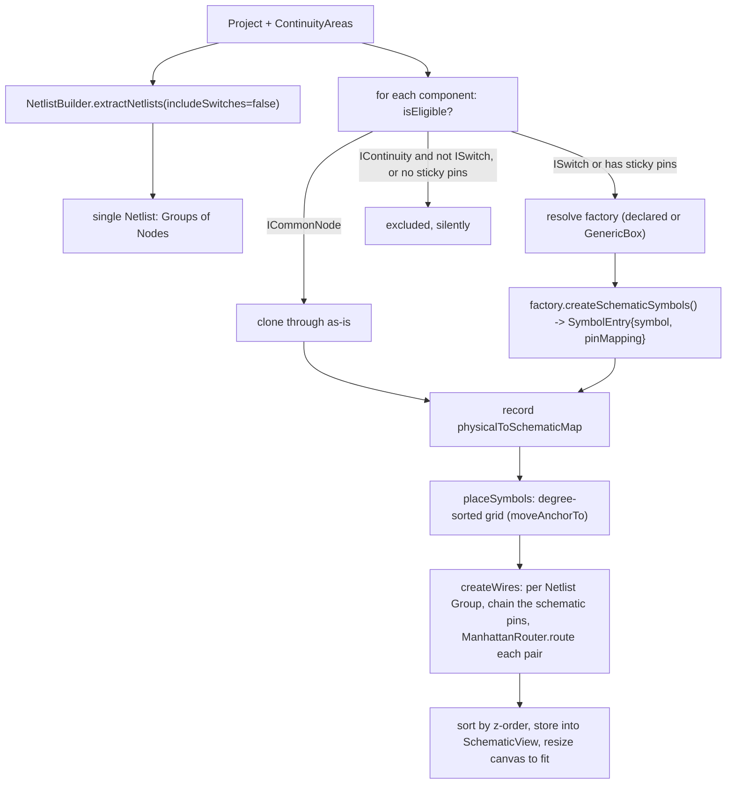

# Schematic View — Architecture Overview

## What it does

DIYLC projects are *physical layouts* — components placed on a board with leads, traces and
wires. The Schematic View derives a **schematic diagram** from that layout on demand: every
real component becomes a schematic symbol, every net becomes an auto-routed wire, and the
result is drawn with the same rendering pipeline as the layout.

It is **derived, not authored**: the user does not draw the schematic. They can rearrange
symbols; wires follow. Switching to the Schematic tab (re)generates it.

## Design principles

1. **Reuse the rendering pipeline.** Schematic symbols are ordinary `IDIYComponent`s drawn by
   the same `DrawingManager` that draws layout components. Wires are components too.
2. **Per-type mapping, with a fallback.** Each physical component type can name an
   `ISchematicFactory`; anything without one gets a generic labeled box. Every component gets
   *some* symbol.
3. **The layout is the source of truth.** The schematic is regenerated / reconciled from the
   layout + its netlist. User edits to the schematic are limited to symbol position.
4. **Zero cost when unused.** The `SchematicView` field on `Project` stays `null` until the
   user first opens the view, so existing `.diy` files are byte-for-byte unchanged.

## Module layout

DIYLC has three Maven modules; `diylc-library` depends on `diylc-core`, `diylc-swing` depends
on both. The Schematic View is spread across all three:

```
diylc-core     data model + SPI (no rendering, no Swing)
  org.diylc.core.SchematicView                 embedded in Project
  org.diylc.core.annotations.ComponentDescriptor.schematicFactory()
  org.diylc.common.ComponentType.schematicFactoryClass
  org.diylc.schematic.ISchematicFactory        the strategy interface
  org.diylc.schematic.SchematicSymbolMapping    factory output: symbol + pin map
  org.diylc.common.INetlistProcessor.getContinuityAreas()   (impl on Presenter)

diylc-library  components + generation logic
  org.diylc.components.schematic.SchematicBox   generic rectangular symbol
  org.diylc.components.schematic.SchematicWire  auto-routed Manhattan wire (IContinuity)
  org.diylc.schematic.ManhattanRouter          routing algorithm (pure)
  org.diylc.schematic.GenericBoxSchematicFactory   default fallback
  org.diylc.schematic.AbstractSimpleSchematicFactory   1:1 pin-for-pin base
  org.diylc.schematic.{Resistor,Capacitor,Diode,Transistor,Inductor,Potentiometer}SchematicFactory
  org.diylc.schematic.SchematicBuilder         initial generation
  org.diylc.schematic.SchematicSynchronizer    incremental reconcile

diylc-swing    UI
  org.diylc.swing.plugins.schematic.SchematicTabPlugin   Layout | Schematic tab strip
  org.diylc.swing.plugins.schematic.SchematicMenuPlugin  Analyze > Schematic View...
  org.diylc.swing.plugins.schematic.SchematicViewFrame   detached viewer window
  org.diylc.swing.plugins.schematic.SchematicPanel       read-only renderer for the window
  org.diylc.swing.plugins.canvas.CanvasPlugin.getCanvasScrollComponent()  (new accessor)
```

## Data model

### `SchematicView` (embedded in `Project`)

```java
class SchematicView implements Serializable, Cloneable {
  List<IDIYComponent<?>> components;              // symbols + wires, z-order ascending
  Map<UUID, List<UUID>> physicalToSchematicMap;   // physical component id -> schematic symbol id(s)
  Size width, height, gridSpacing;
}
```

- `Project.getSchematicView()` returns the field (may be `null`).
- `Project.getOrCreateSchematicView()` lazily creates it — **calling this makes the schematic
  persist with the project from now on**.
- `Project.clone()` and `Project.equals()` include the schematic view, so schematic edits go
  through the normal dirty / undo-snapshot machinery.
- Serialized via XStream alongside the rest of `Project`. Older DIYLC ignores the unknown field.

The `physicalToSchematicMap` is 1:N to support multi-section components (a dual triode → two
triode symbols). Pin mappings are **not** stored — they are a pure function of the physical
component and are recomputed by re-running the factory whenever needed.

### `ISchematicFactory` / `SchematicSymbolMapping`

```java
interface ISchematicFactory {
  List<SchematicSymbolMapping> createSchematicSymbols(IDIYComponent<?> physicalComponent);
}

class SchematicSymbolMapping {
  IDIYComponent<?> schematicSymbol;         // fully configured, only needs positioning
  Map<Integer, Integer> pinMapping;         // physical control-point index -> schematic control-point index
  String sectionLabel;                      // optional, e.g. "Section A"
}
```

A type declares its factory on the annotation:

```java
@ComponentDescriptor(name = "Resistor", ..., schematicFactory = ResistorSchematicFactory.class)
```

`ComponentProcessor.extractComponentTypeFrom` reads it into
`ComponentType.getSchematicFactoryClass()`. The default (`ISchematicFactory.class` itself,
used only as a "none" marker) means **no factory declared → use the generic box**.

## Generation pipeline — `SchematicBuilder.build(project, continuityAreas)`



Key points:

- **Eligibility** (`SchematicBuilder.isEligible`):
  - `ICommonNode` (ground, common node) → eligible, cloned through unchanged.
  - `ISwitch` → eligible (drawn as a symbol; see [0007](0007-switch-handling.md)).
  - other `IContinuity` (wires, traces, solder bridges, board strips) → excluded.
  - no sticky control points (labels, images, shapes, boards) → excluded.
  - Exclusions are silent — no warning.
- **Factory resolution** caches one instance per factory class. Factory exceptions fall back to
  the generic box.
- **Placement** sorts components by connection degree (sum over netlist groups of
  `groupSize - 1`) descending, then drops them into a `ceil(sqrt(n))`-column grid. Multi-symbol
  mappings stack vertically within the cell. `moveAnchorTo` translates *every* control point so
  control point 0 lands on the target — it snapshots targets first, see
  [0006](0006-schematicbox-control-point-model.md).
- **Wiring** walks each `Group`, resolves every `Node` (physical component + pin index) to a
  schematic `(symbol, schematicPinIndex, location)` via the factory's `pinMapping`, sorts the
  pins left-to-right/top-to-bottom, and creates a `SchematicWire` between consecutive pins
  (a chain, not a star). Each wire stores `sourceComponentId/sourcePinIndex` and
  `targetComponentId/targetPinIndex` plus the routed `routePoints`. Already-placed wire
  segments are fed to the router as obstacles.

## Incremental sync — `SchematicSynchronizer.synchronize(project, continuityAreas)`

Runs every time the user switches to the Schematic tab. If the view is empty it does a full
`SchematicBuilder.build`. Otherwise:

- **Kept** components: re-run the factory to get fresh symbols + pin maps, but keep the
  *existing* positioned symbol instance, only refreshing its name/value. (Pin maps are pure
  functions of the physical component, so recomputing is safe and cheaper than persisting.)
- **New** components (id in layout, not in map): place fresh symbols in the next free grid cell.
- **Removed** components (id in map, not in layout): drop their symbols.
- **Wires** are always rebuilt from scratch from the current netlist — they are cheap.

## Routing — `ManhattanRouter`

Pure, no dependencies on the rest of the system. `route(start, end, startDir, endDir,
obstacles, grid)` returns axis-aligned way-points from `start` to `end`.

- Aligned endpoints → a single straight segment.
- Otherwise it generates candidate routes: two L shapes, several
  horizontal-vertical-horizontal routes (vertical middle leg at candidate x positions) and
  several vertical-horizontal-vertical routes, using midpoint / quarter points / grid offsets.
- Each candidate is scored: `length*0.01 + bends*6 + crossings*15 + overlapLength*0.5 +
  directionMismatchPenalty`. `startDir` / `endDir` are the directions the wire should leave
  each pin (away from the symbol centroid, dominant axis — `SchematicBuilder.exitDirection`).
- Lowest score wins; the result is de-duplicated and collinear middle points are dropped.

`SchematicBuilder.rerouteWires(components)` re-routes every wire from the *current* symbol pin
positions (looked up by component id) — used after the user moves a symbol.

## UI

### The tab — `SchematicTabPlugin`

The tab renders through the **real canvas**, not a bespoke widget. See
[0004](0004-schematic-tab-second-presenter.md).

- The plugin owns a second `Presenter` and a second `CanvasPlugin`, installed on that
  presenter. Both `CanvasPlugin`s inject their `RulerScrollPane` into the center `BoxLayout`
  panel; the plugin shows exactly one at a time.
- A `JToolBar` with two `JToggleButton`s (`Layout` / `Schematic`) is injected below them.
  **No zoom or refresh buttons** — rulers, scroll bars and wheel/gesture zoom come from the
  `RulerScrollPane`; refresh is automatic on tab switch.
- Switching to **Schematic**: `SchematicSynchronizer.synchronize(...)` on the layout project,
  wrap the resulting `SchematicView` in a throwaway `Project`, `loadProject()` it into the
  schematic presenter, swap the visible scroll pane, `scrollToCenterAndShowContents()`.
- The wrapper project **locks the `WIRING` layer** so wires are inert; a listener on the
  schematic presenter re-routes wires on `PROJECT_MODIFIED` (fires once when a drag-move ends).
  See [0005](0005-wire-layer-lock-and-reroute.md).

### The detached window — `SchematicMenuPlugin` / `SchematicViewFrame` / `SchematicPanel`

*Analyze → Schematic View…* opens a separate window that renders the `SchematicView` through
a private `DrawingManager` (read-only, no `Presenter`) and adds PNG export. It is independent
of the tab and is the simplest possible viewer.

## How to add a dedicated symbol for a component type

1. Write an `ISchematicFactory` in `diylc-library` under `org.diylc.schematic`. For a simple
   1:1 mapping, extend `AbstractSimpleSchematicFactory` and just return `new XxxSymbol()` from
   `createSymbol()` (override `electricalPinCount()` if not 2).
2. Point the physical component at it: add `schematicFactory = XxxSchematicFactory.class` to
   its `@ComponentDescriptor` and import the class.
3. If the symbol's pin order does not match the physical component's control-point order,
   build the `pinMapping` explicitly instead of using the base class.
4. For multi-section parts (dual triode, dual op-amp) return more than one
   `SchematicSymbolMapping`, each with its own `pinMapping` and a `sectionLabel`.

No other wiring is needed — `SchematicBuilder` discovers the factory through `ComponentType`.

## Testing

Pure-logic pieces have unit tests in `diylc-library/src/test/java/org/diylc/schematic/`:

- `ManhattanRouterTest` — straight vs. bent routes, axis-alignment, endpoint fidelity.
- `GenericBoxSchematicFactoryTest` — pin count / labels, switch eligibility.
- `SchematicRerouteTest` — wire endpoints follow a moved symbol; `SchematicBox` drag/placement
  geometry (every pin translated by exactly the drag delta, in any index order).

`SchematicViewIntegrationTest` (in `diylc-swing`) exercises build → sync → render end to end
through a real `Presenter`. **Note:** the `diylc-swing` test module currently fails to resolve
`org.reflections` in some local setups (pre-existing — `PresenterTests` fails the same way),
so this test may not run locally; it is expected to run in CI.

## Known limitations

- The schematic canvas blocks wire interaction, but not symbol add / delete / paste /
  value-edit; there is no shared undo with the layout history.
- `rerouteWires` recomputes *all* wires on every move; routing is not globally crossing-aware.
- Placement is a degree-sorted grid, not signal-flow or true clustering.
- Multi-section (1:N) factories for tubes, dual op-amps and multi-pole switches are not done —
  those fall back to the generic box.
- 3-pin factories (`Transistor`, `Potentiometer`) map legs to symbol legs in index order,
  which may not match every package's pin-out.
- No print or PDF/SVG export for the schematic (PNG only, from the detached window).
- The schematic symbols do not follow rotation/mirroring cleanly (`SchematicBox` derives its
  body from an axis-aligned anchor).

## Gotchas for future work

- `ISwitch extends IContinuity`. Any "exclude `IContinuity`" check must special-case switches.
- `SchematicView` participating in `Project.equals()` means opening the schematic marks the
  project modified (intended, but surprising).
- A rigid multi-pin component (`SchematicBox`, `ICSymbol`) must **not** recompute its other
  control points inside `setControlPoint` — the presenter drags all points one at a time and a
  recompute double-applies the delta. See [0006](0006-schematicbox-control-point-model.md).
- Component source files in this repo have mixed CRLF/LF line endings and ISO-8859-1 encoding.
  Bulk-editing them with a tool that normalizes newlines produces enormous phantom diffs —
  preserve the original newline style per file.
