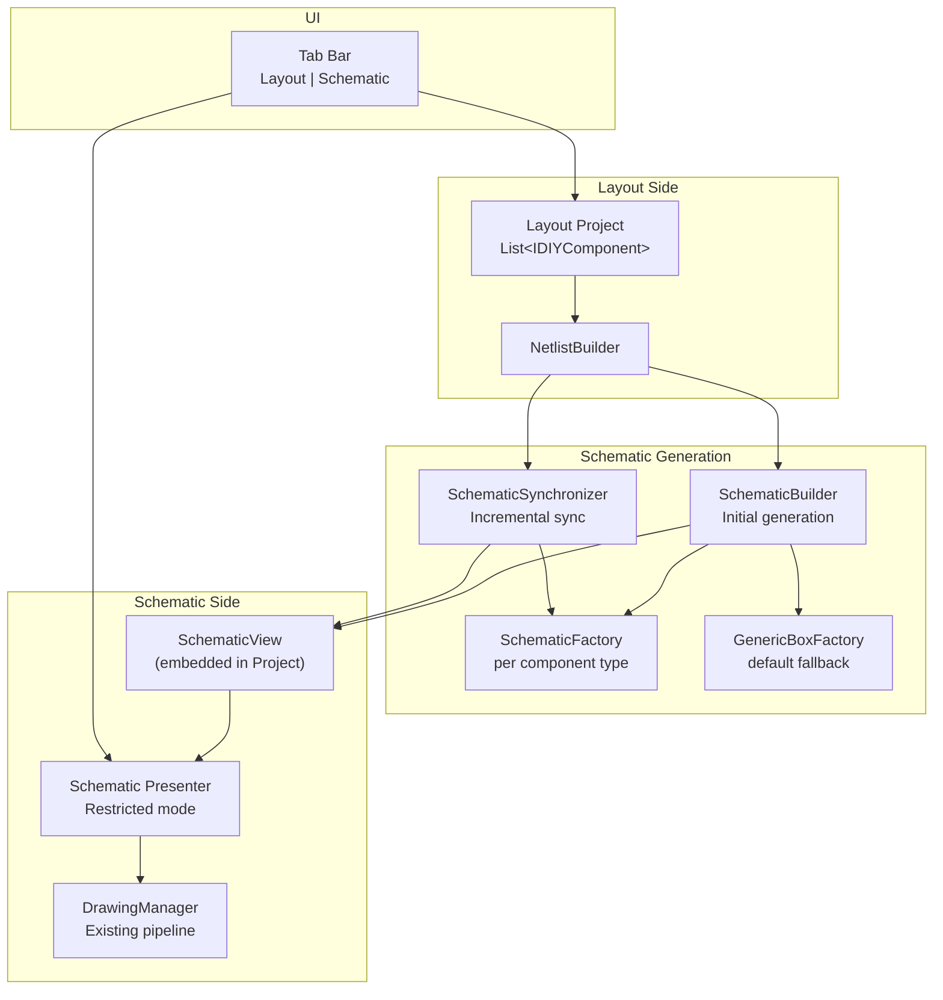

# DIYLC Schematic View — Feature Specification

## Overview

Add the ability to generate and display a schematic diagram representation of a physical layout project at any time. The schematic is derived from the existing netlist infrastructure and rendered using DIYLC's existing rendering pipeline. Users can view, rearrange, and export the schematic to verify their circuit at a glance.

---

## 1. Architecture Overview



---

## 2. Data Model

### 2.1 SchematicView (new class, embedded in Project)

Storage: new field on [`Project`](file:///Users/branislavstojkovic/GitHub/diy-layout-creator/diylc/diylc-core/src/main/java/org/diylc/core/Project.java) — `private SchematicView schematicView`.

Serialized inside the `.diy` file alongside existing project data. **Lazily initialized** — the field remains `null` until the user first opens the Schematic tab, keeping files unchanged for users who don't use the feature.

```java
public class SchematicView implements Serializable {
    // Schematic components (symbols + wires)
    private List<IDIYComponent<?>> components;
    
    // Mapping: physical component UUID → list of schematic symbol UUIDs
    // (1:N for multi-section components like dual triodes/opamps)
    private Map<UUID, List<UUID>> physicalToSchematicMap;
    
    // Canvas dimensions
    private Size width;
    private Size height;
    private Size gridSpacing;
}
```

### 2.2 Component Identity

Physical ↔ Schematic matching uses the physical component's **UUID** (`IDIYComponent.getId()`). The `physicalToSchematicMap` tracks which schematic symbol(s) were spawned from each physical component.

---

## 3. Component Mapping: Physical → Schematic

### 3.1 Factory/Strategy Pattern

Each physical component type can declare a `SchematicFactory` via a new attribute on [`@ComponentDescriptor`](file:///Users/branislavstojkovic/GitHub/diy-layout-creator/diylc/diylc-core/src/main/java/org/diylc/core/annotations/ComponentDescriptor.java):

```java
@ComponentDescriptor(
    name = "Tube Socket", 
    category = "Tubes",
    schematicFactory = TubeSocketSchematicFactory.class,  // NEW
    ...
)
public class TubeSocket extends AbstractAngledComponent<String> { ... }
```

When no `schematicFactory` is specified, a **`GenericBoxSchematicFactory`** is used as the default fallback.

### 3.2 ISchematicFactory Interface

```java
public interface ISchematicFactory {
    /**
     * Creates schematic symbol instances for a given physical component.
     * Returns fully instantiated, configured IDIYComponent instances
     * that just need positioning.
     * 
     * @param physicalComponent the physical layout component
     * @return list of SchematicSymbolMapping entries (1:1 or 1:N)
     */
    List<SchematicSymbolMapping> createSchematicSymbols(
        IDIYComponent<?> physicalComponent);
}

public class SchematicSymbolMapping {
    // The fully configured schematic symbol instance
    private IDIYComponent<?> schematicSymbol;
    
    // Pin mapping: physical control point index → schematic control point index
    private Map<Integer, Integer> pinMapping;
    
    // Optional section label (e.g., "Section A", "Section B" for dual triodes)
    private String sectionLabel;
}
```

### 3.3 Factory Returns Fully Instantiated Components

The factory's `createSchematicSymbols()` method returns **ready-to-use `IDIYComponent` instances**. This gives factories full control over:
- Which schematic symbol class to use
- Property values (name, value, display mode)
- For multi-section components: which sections get shared pins (heaters, B+, etc.)

### 3.4 Default Fallback: GenericBoxSchematicFactory

For any physical component without a declared factory, the `GenericBoxSchematicFactory`:
1. Inspects `getControlPointNodeName(i)` for each sticky control point
2. Creates a `SchematicBox` component with those labeled terminals
3. Copies the component's name and value

### 3.5 Exclusion Criteria

A physical component is **excluded from the schematic** if:
- It implements `IContinuity` (wires, traces, solder bridges, board strips) — these are represented as connections, not symbols
- It has **no sticky control points** (decorative elements, labels, images, shapes, boards)

> [!IMPORTANT]
> Components are silently excluded. No warning is shown to the user.

### 3.6 Pin Name Matching for 1:N Mapping

For multi-section components (e.g., dual triode tube sockets), pin names follow a convention:
- Physical: `G1, P1, K1, H+, H-, G2, P2, K2`
- Schematic TriodeSymbol section 1: `G, P, K, H+, H-`
- Schematic TriodeSymbol section 2: `G, P, K`

The factory code handles:
- Stripping numeric suffixes to match section pins
- Deciding which section gets shared pins (e.g., heaters on section 1 only)
- Full programmatic control — no rigid convention imposed

---

## 4. New Components

### 4.1 SchematicBox (new component)

A new `IDIYComponent` in `diylc-library`, category "Schematic Symbols".

Purpose: generic rectangular IC-style schematic symbol with configurable terminals, similar to KiCad's generic symbol.

Key properties:
- **Left nodes**: comma-separated string for pins on the left side (typically inputs)
- **Right nodes**: comma-separated string for pins on the right side (typically outputs)
- **Top nodes**: comma-separated string for pins on the top side (typically positive power)
- **Bottom nodes**: comma-separated string for pins on the bottom side (typically ground/negative power)
- **Body label**: component name and/or value
- **Display**: NAME / VALUE / BOTH / NONE

```java
@ComponentDescriptor(
    name = "Box", 
    category = "Schematic Symbols",
    instanceNamePrefix = "U",
    description = "Generic schematic box with configurable terminals",
    zOrder = IDIYComponent.COMPONENT
)
public class SchematicBox extends AbstractTransparentComponent<String> {
    private String leftNodes = "1,2";
    private String rightNodes = "3,4";
    private String topNodes = "";
    private String bottomNodes = "";
    // ... rendering, control points, etc.
}
```

### 4.2 SchematicWire (new component)

A new `IDIYComponent` for rendering Manhattan-routed connections in the schematic.

Key characteristics:
- Implements `IContinuity`
- Draws horizontal/vertical line segments with automatic 90° bends
- Knows its source and destination node (component UUID + pin index)
- **Auto-routed**: path is calculated, not user-editable
- **Targeted re-routing**: when a connected symbol moves, only its wires recalculate
- Route minimizes overlap with other wires (simple collision avoidance). Design an algorithm that detects whether the line should be straight horizontal or vertical or it needs to bend horizontal-vertical-horizontal or vertical-horizontal-vertical.

```java
@ComponentDescriptor(
    name = "Schematic Wire",
    category = "Schematic Symbols",
    description = "Auto-routed Manhattan wire for schematic connections",
    zOrder = IDIYComponent.WIRING,
    creationMethod = CreationMethod.POINT_BY_POINT
)
public class SchematicWire extends AbstractComponent<Void> implements IContinuity {
    private UUID sourceComponentId;
    private int sourcePinIndex;
    private UUID targetComponentId;
    private int targetPinIndex;
    private List<Point2D> routePoints;  // calculated waypoints
    // ...
}
```

---

## 5. Schematic Generation & Sync

### 5.1 SchematicBuilder (initial generation)

Located in `diylc-core` (e.g., `org.diylc.schematic.SchematicBuilder`).

**Input**: `Project` (with layout components) + `Netlist` (from `NetlistBuilder.extractNetlists(false, ...)` — switches treated as components, single netlist output)

**Process**:

1. **Filter components**: exclude `IContinuity` implementors and components with no sticky points
2. **Create symbols**: for each remaining physical component:
   - Look up its `@ComponentDescriptor.schematicFactory`
   - If present, instantiate the factory and call `createSchematicSymbols(component)`
   - If absent, use `GenericBoxSchematicFactory`
   - Record mappings in `physicalToSchematicMap`
3. **Include common nodes**: `GroundSymbol` and `CommonNode` components pass through as-is (they're already schematic-compatible)
4. **Initial placement**: grid layout with connection-density awareness
   - Heavily connected components placed closer together
   - Simple grid arrangement (left-to-right, top-to-bottom)
   - No signal-flow inference
5. **Create wires**: for each `Group` in the `Netlist`, create `SchematicWire` components connecting the corresponding schematic symbol pins
6. **Route wires**: calculate Manhattan-style paths for all wires
7. **Copy values**: schematic symbols inherit name and value from their physical counterpart

### 5.2 SchematicSynchronizer (incremental sync)

Triggered **automatically when the user switches to the Schematic tab** (silent, no diff shown).

**Process**:

1. Rebuild the netlist from the current layout
2. Compare `physicalToSchematicMap` against current layout components:
   - **New components** (UUID in layout but not in map): create schematic symbols via factory, place near related components
   - **Deleted components** (UUID in map but not in layout): remove schematic symbols and their wires
   - **Existing components**: update name/value if changed, preserve position
3. Rebuild all wires based on the new netlist (wires are cheap to regenerate)
4. Re-route wires for moved/new symbols

### 5.3 Netlist Usage

Use `NetlistBuilder.extractNetlists(includeSwitches=false, project, continuityAreas)` — this mode:
- Treats switches as regular components (not expanded into position combinations)
- Returns a single `Netlist`
- Already accounts for `IContinuity` connections and conductive areas
- Each `Group` in the netlist represents a set of connected `Node`s (component + pin index)

---

## 6. UI: Tab-Based View

### 6.1 Tab Bar

Add a tab bar above the main canvas with two tabs: **Layout** | **Schematic**

- Default: Layout tab active
- Clicking "Schematic" triggers lazy generation (first time) or sync (subsequent times)
- Tab styling consistent with the application's look and feel

### 6.2 Schematic Presenter (restricted mode)

Two separate `Presenter` instances:
- **Layout Presenter**: existing behavior, full edit capabilities
- **Schematic Presenter**: configured restrictively at construction time

The Schematic Presenter operates on `project.getSchematicView().getComponents()` instead of `project.getComponents()`.

Use the same Presenter class but configure it differently so it behaves differently.

**Allowed operations** in schematic mode:
| Operation | Allowed? |
|---|---|
| Move (drag) symbols | ✅ |
| Multi-select and move | ✅ |
| Rotate symbols | ✅ |
| Flip/mirror symbols | ✅ |
| Edit display properties | ✅ |
| Resize canvas | ✅ |
| Export as image (PNG/PDF/SVG) | ✅ |
| Print | ✅ |
| Add components | ❌ |
| Delete components | ❌ |
| Paste components | ❌ |
| Edit component values | ❌ |
| Drag wires | ❌ |

### 6.3 Wire Re-routing on Move

When the user moves a symbol:
- **During drag**: show rubber-band or simple direct lines (preview)
- **On mouse release**: re-route only the wires connected to the moved symbol(s)
- Other wires remain unchanged

### 6.4 Undo/Redo

**Shared undo/redo stack** with the layout. All schematic operations (moves, rotations, flips) go into the same history as layout operations.

### 6.5 Rendering

The schematic uses the **existing `DrawingManager` + `Presenter`** rendering pipeline. The schematic sub-project is a standard `Project`-like structure containing `IDIYComponent` instances — the same rendering code that draws layout components draws schematic symbols.

---

## 7. File Format Impact

### 7.1 Backward Compatibility

- The `SchematicView` field on `Project` defaults to `null`
- Files saved without opening the schematic tab contain no schematic data
- Older DIYLC versions will ignore the new field (XStream handles unknown fields gracefully)

### 7.2 Forward Compatibility

- Once the schematic is generated and the file is saved, the schematic data is persisted
- Subsequent file opens will have the schematic data available immediately

---

## 8. Implementation Phases

### Phase 1: Foundation (MVP)
1. Add `SchematicView` to `Project`
2. Create `ISchematicFactory` interface and `SchematicSymbolMapping`
3. Create `SchematicBox` component (generic box with configurable terminals)
4. Create `SchematicWire` component (Manhattan-routed wire)
5. Add `schematicFactory` attribute to `@ComponentDescriptor`
6. Implement `GenericBoxSchematicFactory` (default fallback)
7. Implement `SchematicBuilder` (initial generation with grid placement)
8. Implement basic Manhattan wire routing
9. Add tab UI (Layout | Schematic). It should be at the bottom left, similar to excel sheets
10. Create a restricted Schematic Presenter

### Phase 2: Symbol Coverage
11. Implement dedicated factories for common components:
    - `ResistorSchematicFactory` → `ResistorSymbol`
    - `CapacitorSchematicFactory` → `CapacitorSymbol` (axial, radial, electrolytic, etc.)
    - `DiodeSchematicFactory` → `DiodeSymbol` (glass, plastic, zener, Schottky, LED, etc.)
    - `TransistorSchematicFactory` → `BJTSymbol` (TO-92, TO-220, TO-3, TO-126, TO-1)
    - `FETSchematicFactory` → `JFETSymbol`, `MOSFETSymbol`
    - `PotentiometerSchematicFactory` → `PotentiometerSymbol`
    - `InductorSchematicFactory` → `InductorSymbol`
    - `TubeSocketSchematicFactory` → `TriodeSymbol`, `PentodeSymbol`, `DuoDiodeSymbol` (1:N)
    - `DIL_ICSchematicFactory` → `ICSymbol` or `SchematicBox` (1:N for dual opamps)
    - `SwitchSchematicFactory` → `SwitchLatchingSymbol` or `SchematicBox`

### Phase 3: Sync & Polish
12. Implement `SchematicSynchronizer` (incremental updates)
13. Implement smart initial placement (connection-density awareness)
14. Implement targeted wire re-routing on symbol move
15. Add export (image/PDF) and print for schematic view
16. Shared undo/redo integration

### Phase 4: Future Enhancements (out of scope for now)
- Junction dots at T-connections
- User-adjustable wire bend points
- Net labels (toggle-able)
- Side-by-side layout + schematic view
- Real-time sync on layout changes
- Advanced auto-routing with crossing avoidance

---

## 9. Key Design Decisions Summary

| Decision | Choice | Rationale |
|---|---|---|
| Mapping mechanism | `@ComponentDescriptor.schematicFactory` + `ISchematicFactory` | Scalable, per-type control, complex 1:N support |
| 1:N handling | Factory returns multiple configured instances | Full control over shared pins (heaters, B+) |
| Pin mapping | Factory-controlled, name matching with explicit overrides | Flexible, handles sections and shared pins |
| Storage | Embedded in `Project` as `SchematicView` field | Single file, lazy initialization |
| Wire rendering | Dedicated `SchematicWire` component, Manhattan routing | Proper schematic appearance |
| UI | Tab alongside canvas (Layout \| Schematic) | Clean, familiar paradigm |
| Sync | Auto-sync on tab switch, silent | Seamless UX |
| Rendering | Existing `DrawingManager` + `Presenter` | Maximum code reuse |
| Fallback | `GenericBoxSchematicFactory` for unmapped components | Everything gets a symbol |
| Exclusions | `IContinuity` + no sticky points | Clean schematic |
| Undo | Shared stack | Unified history |
| Net labels | Not shown (MVP) | Reduce clutter |
| Wires on move | Re-route connected wires only, on mouse release | Efficient |
| Switch handling | Netlist built with `includeSwitches=false`, switches rendered as symbols | Single netlist, clean schematic |
| Initial placement | Grid with connection-density awareness | Good enough starting point |

---

## 10. Open Questions

> [!IMPORTANT]
> **Multi-section component coverage**: How many multi-section ICs need dedicated factories at launch? Just tubes and common opamps (TL072, NE5532, LM358), or broader coverage? This affects Phase 2 scope.

> [!IMPORTANT]
> **SchematicBox terminal layout**: Should pins always be distributed left/right (like a DIP IC), or should we also support top/bottom terminal placement for power supply pins?

> [!NOTE]
> **Serialization**: The `SchematicView` will be serialized via XStream alongside the existing `Project` fields. We should verify that all new classes (`SchematicWire`, `SchematicBox`, `SchematicSymbolMapping`) serialize cleanly and don't break older DIYLC versions opening new files.

---

## 11. Implementation Status

### Done

**diylc-core**
- `@ComponentDescriptor.schematicFactory` attribute; surfaced on `ComponentType.getSchematicFactoryClass()` via `ComponentProcessor`.
- `ISchematicFactory` + `SchematicSymbolMapping` SPI (`org.diylc.schematic`).
- `SchematicView` entity (`org.diylc.core`) — components, `physicalToSchematicMap`, canvas size; lazy field on `Project` (`getSchematicView()` / `getOrCreateSchematicView()`), wired into `Project.clone()` and `equals()`. Stays `null` for projects that never open the view, so existing `.diy` files are byte-for-byte unchanged.
- `INetlistProcessor.getContinuityAreas()` (implemented on `Presenter`) so the schematic can be built outside the presenter.

**diylc-library**
- `SchematicBox` component (`org.diylc.components.schematic`) — generic box with configurable left/right/top/bottom comma-separated terminal lists, NAME/VALUE/BOTH/NONE display.
- `SchematicWire` component — auto-routed Manhattan connection; implements `IContinuity`; stores source/target component id + pin index and the calculated `routePoints`; deep-cloned.
- `ManhattanRouter` — straight / L / HVH / VHV routing with pin exit-direction preference and overlap/crossing cost scoring against existing segments.
- `GenericBoxSchematicFactory` (default fallback) + `SchematicBuilder` (filter, symbol creation, connection-density grid placement, per-net wire chaining, canvas auto-resize) + `SchematicSynchronizer` (add/remove/keep-position incremental sync, full wire rebuild). Switches (`ISwitch`, which extends `IContinuity`) are treated as regular symbols — the generic box fallback until a dedicated factory is added — since the netlist is built with `includeSwitches=false`.
- Concrete factories: `Resistor`, `Capacitor`, `Diode`, `Transistor` (→ `BJTSymbol`), `Inductor`, `Potentiometer`, wired onto the common physical component types (resistors, film/ceramic/electrolytic/tantalum/mica caps, plastic/glass diodes, TO-1/92/126/220/3 transistors, radial/toroidal inductors, panel/trimmer/miniature pots).

**diylc-swing**
- `SchematicTabPlugin` adds the Excel-style tab strip (**Layout | Schematic**) below the canvas. It owns a **second `Presenter` + `CanvasPlugin`**, so the schematic renders through the exact same `RulerScrollPane` — rulers, scroll bars, wheel/gesture zoom — as the layout canvas, with no extra controls. Selecting **Schematic** runs `SchematicSynchronizer` automatically and loads the resulting wrapper `Project` into the schematic presenter; selecting **Layout** swaps the visible scroll pane back. `CanvasPlugin.getCanvasScrollComponent()` exposes each scroll pane so the plugin can show/hide it.
- The wrapper project **locks the `WIRING` layer**, so `SchematicWire`s cannot be selected, dragged or detached from symbols; symbols (on the `COMPONENT` layer) stay movable. `SchematicWire.draw()` forces an opaque composite so the lock-alpha dimming does not fade the wires.
- When the user moves a symbol, `SchematicTabPlugin` listens for `EventType.PROJECT_MODIFIED` on the schematic presenter and calls `SchematicBuilder.rerouteWires()`, which re-computes every wire route from the current symbol pin positions so wires stay attached.
- `SchematicMenuPlugin` / `SchematicViewFrame` / `SchematicPanel` — a detached-window viewer (*Analyze → Schematic View…*) that renders the `SchematicView` through a private `DrawingManager` and adds PNG export. Independent of the tab.

Unit tests: `ManhattanRouterTest`, `GenericBoxSchematicFactoryTest` (library); `SchematicViewIntegrationTest` (swing — end-to-end build/sync/render).

### Not yet done (follow-ups)

- Wires are fully inert (locked layer) and re-route automatically after a symbol move, but the schematic canvas is otherwise not **restricted**: there is no explicit block on add / delete / paste / value-edit of symbols, and no shared undo integration with the layout history.
- Re-routing currently recomputes every wire on each move; targeted re-routing of only the affected wires, and crossing-aware routing, are follow-ups.
- Shared undo/redo integration with the layout history.
- Multi-section 1:N factories (`TubeSocket` → triode/pentode/duo-diode, `DIL_IC` → dual op-amps, switches).
- Smarter placement (true connection-density clustering) and crossing-aware routing.
- Print support and PDF/SVG export for the schematic.
- Round-trip XStream serialization verification for the new classes.
